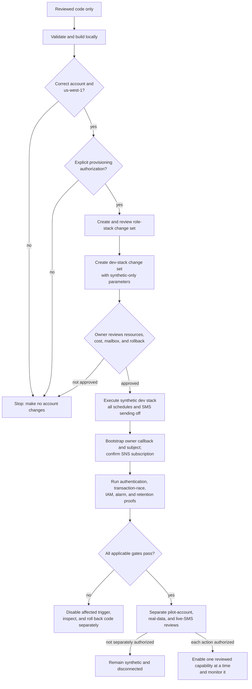

# Pilot infrastructure plan (code only)

Issue [#23](https://github.com/EA-AI-Projects/small-business-scheduling-assistant/issues/23) targets `us-west-1`. The synthetic `dev` stack goes in the dedicated member account `214965372605`; the `pilot` stack, which will hold real client data, is planned for its own separate account (see [ARCHITECTURE.md](ARCHITECTURE.md)). The `template.yaml` stack is a reviewable foundation for the authenticated owner calendar. It has **not** been deployed; provisioning, owner account creation, live SMS, and customer data onboarding each need a separate authorized step.

## Current stack boundary

- The owner HTTP API exposes only the owner API under `/v1/owner/{proxy+}`; the owner web app is a separate static Amplify app (`frontend/`). API Gateway checks a Cognito JWT on the explicit GET, POST, PUT, PATCH, and DELETE owner API routes; there is deliberately no `ANY` or `OPTIONS` route, so the HTTP API CORS configuration answers browser preflight requests without the authorizer; the FastAPI verifier also requires the exact issuer, client ID, access-token type, owner subject, and business ID. The local synthetic API and Twilio webhooks are not routed by this stack.
- A single on-demand DynamoDB table has the `PK`/`SK` primary key, `HoldDueIndex`, and `OutboxDueIndex` expected by the adapters. Point-in-time recovery is enabled and CloudFormation retains the table on stack deletion or replacement. Deleting a stack therefore does **not** delete customer records.
- Two encrypted SQS Standard queues, each with a dead-letter queue, are defined: one for outbox delivery and one for SMS conversation receipts. The SMS sender has a **disabled** SQS event source and requires `SmsSendEnabled=authorized` plus an explicit recipient allowlist, so deployment alone cannot send a text. Hold expiry, outbox dispatch, note retention, and SMS retention rules are also **disabled**. Operators must only enable them as part of an approved, monitored deployment. In particular, enabling outbox dispatch without its consumer would accumulate messages.
- Lambda logs have 30-day retention. Error alarms cover the API and each worker; each dead-letter queue has a depth alarm. The expiry and outbox workers emit structured JSON with their oldest observed due age, and CloudWatch metric filters alarm when either exceeds 15 minutes. Every alarm publishes to an SNS topic with an email subscription supplied through the required `AlarmEmail` parameter. The mailbox must confirm its subscription before alarms can be relied on. No email address is stored in the repository.
- The Twilio webhook API is conditional and off by default. When enabled, it verifies the exact signed inbound/status URLs and retrieves the auth token from the environment-specific SSM SecureString path `/scheduling/{dev|pilot}/twilio/auth-token` at cold start; a plaintext `String` parameter is rejected. The SQS sender uses the same scoped parameter and refuses to send unless the active ingress API base and both exact callback URLs agree. The token is never in the template or Lambda environment. CloudFormation cannot create the SecureString value. A customer-managed KMS key would need a separately scoped decrypt grant. No token, real phone number, or recipient list belongs in this repository.
- SMS evidence legal-hold management and a GitHub OIDC deploy role remain to be integrated. The SMS conversation layer is in the template (a receipt queue, its dead-letter queue, and a worker) but stays inert: it runs only when SMS ingress is on, `SmsSendEnabled=authorized`, and `EnableSmsConversations=authorized`, and it reads an OpenAI key from a SecureString that CloudFormation cannot create. This foundation does not authorize real messaging.

## Design diagrams

The diagrams show the intended deployed topology and the operational gates around it. They are not evidence that any resource has been provisioned. A dashed line is a path that is conditional or disabled in the initial stack; the labels on those lines name the relevant gate.

### Runtime topology

```mermaid
flowchart LR
    Owner[Business owner] --> App[Amplify static owner app]
    App -->|authorization code + PKCE| Cognito[Cognito hosted UI and user pool]
    App -->|access token| OwnerApi[Owner HTTP API<br/>JWT authorizer]
    OwnerApi -->|GET / POST / PUT / PATCH / DELETE| OwnerFn[Owner API Lambda]
    OwnerFn --> Table[(DynamoDB scheduling table<br/>PK / SK + due indexes + PITR)]

    Customer[Approved SMS recipient] -.->|EnableSmsIngress=true| Twilio[Twilio]
    Twilio -.->|signed inbound and status webhooks| SmsApi[Conditional SMS HTTP API]
    SmsApi -.-> IngressFn[SMS ingress Lambda]
    IngressFn -.-> ReceiptQ[[SMS conversation queue]]
    ReceiptQ -.->|three authorization gates| ConversationFn[SMS conversation Lambda]
    ConversationFn -.-> Table
    ConversationFn -.-> OpenAISecret[SSM SecureString<br/>OpenAI key]

    HoldSchedule[Hold-expiry schedule] -.->|disabled initially| HoldFn[Hold-expiry Lambda]
    HoldFn -->|HoldDueIndex| Table
    OutboxSchedule[Outbox-dispatch schedule] -.->|disabled initially| DispatchFn[Outbox-dispatch Lambda]
    DispatchFn -->|OutboxDueIndex| Table
    DispatchFn --> OutboxQ[[Outbox queue]]
    OutboxQ -.->|event source disabled + send authorization| SenderFn[SMS sender Lambda]
    SenderFn -.-> Twilio

    NoteSchedule[Note-retention schedule] -.->|disabled initially| NoteFn[Note-retention Lambda]
    SmsSchedule[SMS-retention schedule] -.->|disabled initially| SmsRetentionFn[SMS-retention Lambda]
    NoteFn --> Table
    SmsRetentionFn --> Table

    ReceiptQ --> ReceiptDlq[[Conversation DLQ]]
    OutboxQ --> OutboxDlq[[Outbox DLQ]]
    Secrets[SSM SecureString<br/>Twilio auth token] -.-> IngressFn
    Secrets -.-> SenderFn

    Observability[CloudWatch logs, metrics,<br/>error and age alarms] --> AlarmTopic[SNS alarm topic]
    AlarmTopic -->|subscription must be confirmed| Mailbox[Owner-monitored mailbox]
    OwnerFn --> Observability
    IngressFn -.-> Observability
    ConversationFn -.-> Observability
    SenderFn -.-> Observability
    HoldFn --> Observability
    DispatchFn --> Observability
    NoteFn --> Observability
    SmsRetentionFn --> Observability
    ReceiptDlq --> Observability
    OutboxDlq --> Observability
```



The table is the system of record; SQS carries work rather than owning scheduling state. Both queues redrive failed messages to their own DLQ. The diagram groups CloudWatch components to keep the topology readable: each Lambda has an error alarm, each DLQ has a depth alarm, and the hold-expiry and outbox-dispatch logs also feed oldest-due-age metric alarms.

### Deployment and enablement gates



Provisioning, real-data onboarding, SMS ingress, conversation processing, and SMS sending are separate decisions. Passing the synthetic `dev` checkpoint does not imply authorization for the `pilot` account or live traffic. In particular, the initial deployment keeps all four schedules and the SMS sender event source disabled; SMS conversation processing additionally requires ingress, sending, and conversation authorization.

## Build and preflight

From the repository root, run `sam validate --lint --template-file template.yaml --region us-west-1` and `sam build --template-file template.yaml`. These commands only validate and build local artifacts. Before any separately authorized deployment, run `aws sts get-caller-identity` and reject any account other than the target for that stack (`214965372605` for `dev`; `pilot` has no account yet, so it is rejected until one is recorded); check the CLI region is `us-west-1`. Use separate `dev` and `pilot` stack names, a unique Cognito domain prefix, and an owner-monitored `AlarmEmail` mailbox. `OwnerAppOrigin` is the exact Amplify owner app origin (`https://host[:port]`, no path or trailing slash). The owner HTTP API's CORS configuration allows only that origin, the owner route methods, and the `Authorization`, `Content-Type`, and `Idempotency-Key` headers, without credentials; API Gateway answers preflight requests itself. The same origin plus `/` is the Cognito callback and logout URL, and the origin reaches the Lambda as `OWNER_APP_ORIGIN`. Until the Amplify app exists, use an inert value such as `https://example.invalid`.

The first stack creation needs placeholders for `OwnerSub` and `OwnerAppOrigin`: the owner subject and the Amplify app origin do not yet exist. Use an inert origin such as `https://example.invalid`, and do not sign in or send any owner API traffic. Create the single owner user. Create the Amplify app with platform `WEB`. For `dev`, the owner app is a manual deploy with no Git connection (owner decision, 2026-09-30, #43): AWS gets no repository access, pushes trigger no builds (no build minutes), and each update is an explicit upload. Create the app with `aws amplify create-app --name scheduling-owner-dev --platform WEB --custom-headers <customHeaders YAML> --region us-west-1`, then `aws amplify create-branch --app-id <app id> --branch-name main --region us-west-1`. Build locally from `frontend/` with `NEXT_PUBLIC_API_BASE_URL` (`OwnerApiUrl`, no trailing slash), `NEXT_PUBLIC_COGNITO_DOMAIN` (`OwnerCognitoDomain`), `NEXT_PUBLIC_COGNITO_CLIENT_ID` (`OwnerAppClientId`), `NEXT_PUBLIC_BUSINESS_ID=dev-synthetic`, and `NEXT_PUBLIC_AUTH_MODE=cognito`, run `npm run check:export`, and zip the contents of `frontend/out`. Deploy with `aws amplify create-deployment --app-id <app id> --branch-name main --region us-west-1` (returns `jobId` and `zipUploadUrl`), upload the zip to `zipUploadUrl` with an HTTP PUT, then `aws amplify start-deployment --app-id <app id> --branch-name main --job-id <job id> --region us-west-1`. A manual app cannot read `customHttp.yml` from a repository, so its headers are applied with `--custom-headers` in the non-monorepo `customHeaders:` format (the `pattern`/`headers` entries of `customHttp.yml` without the `applications`/`appRoot` wrapper); `customHttp.yml` is the source of that value, and their presence is verified after deploy. The origin is `https://main.<app id>.amplifyapp.com`. `amplify.yml` and `customHttp.yml` remain the source for a future Git-connected app, which would be a new Amplify app with a new origin followed by one reviewed `OwnerAppOrigin` change set. The build variables come from the stack outputs `OwnerApiUrl`, `OwnerCognitoDomain`, and `OwnerAppClientId`, plus `NEXT_PUBLIC_BUSINESS_ID` equal to the stack's `BusinessId` parameter (see `frontend/README.md`). Then update `OwnerAppOrigin` to the exact Amplify origin and `OwnerSub` to that user's Cognito `sub`. Only after this update should the owner sign in through the hosted UI with authorization code and PKCE. Verify that the Amplify response headers from `customHttp.yml` are present, that a browser preflight is answered by API Gateway, that an unauthenticated owner API call fails and whether that 401 carries `Access-Control-Allow-Origin`, and that only that exact subject can read the pilot business calendar. Seed the documented owner policy through the authenticated API before any booking writes. Do not use a broadly shared owner account.

Keep `EnableSmsIngress=false` until its separately authorized setup is complete. Because `SmsApiUrl` exists only after enabling that resource, use a two-step bootstrap: create the SecureString at the exact `/scheduling/${Environment}/twilio/auth-token` path first; enable ingress with the inert `example.invalid` signed URLs while the Twilio number still points nowhere; read `SmsApiUrl`; immediately update both URL parameters to that exact base plus `/webhooks/sms/inbound` and `/webhooks/sms/status`. Then verify invalid signatures fail and a synthetic valid signature works before configuring Twilio's approved number. Keep the SQS trigger disabled and `SmsSendEnabled=disabled` throughout this bootstrap. Do not accept real traffic until the exact URLs, retention schedules, monitoring, consent gates, and separate live-SMS authorization are in place.

## Integration proof still required

Three opt-in tests in `backend/tests/test_dynamodb_local_races.py` exercise actual conditional transactions and the outbox adapter against [AWS DynamoDB Local](https://docs.aws.amazon.com/amazondynamodb/latest/developerguide/DynamoDBLocal.DownloadingAndRunning.html). Start the official local Java server on a loopback port and run `DYNAMODB_LOCAL_URL=http://127.0.0.1:8013 python -m pytest backend/tests/test_dynamodb_local_races.py`. The fixture creates a unique synthetic table with the two due indexes, then deletes it. It rejects non-loopback endpoints. On DynamoDB Local 3.3.1, approval versus expiry and replacement swap versus an adversarial stale cancellation each produced one committed transaction and one conflict, with no partial audit/outbox write. The cancellation bypasses `LifecycleService`, which would reject it while a replacement guard is active; this second check probes repository atomicity rather than a supported user action. A committed approval also produced one due outbox record that the real DynamoDB adapter handed to a fake queue after bounded polling for local GSI visibility; a fake sender claimed it once and duplicate consumption skipped. No SQS or Twilio traffic occurred. These local results do not prove AWS IAM, deployed GSI propagation timing, SQS/DLQ behavior, or deployed Lambda/EventBridge behavior.

Use a synthetic `dev` stack after separate provisioning authorization. Repeat the transaction races in AWS, including two simultaneous approvals for one slot; the expected result is at most one committed reservation, with a conflict or current terminal state and no partial outbox event for losing commands. Check SQS duplicate delivery, worker retry and DLQ redrive with a fake sender, then attach an explicitly authorized SMS test number only after Twilio campaign/number approval and the consent/STOP gates. Verify scheduled note and SMS purge with synthetic expired records and legal holds before onboarding real records. No live AWS integration results are claimed by this document.

## Rollback and monitoring

Keep the previous Lambda artifact/version for a code rollback. Disable schedules and event source mappings before rollback if workers cause errors. Roll back code separately from data; the table is retained and point-in-time recovery is the last-resort data recovery mechanism, not an automatic schema rollback. Before real data or scheduled workers are enabled, confirm the SNS subscription from the `AlarmEmail` mailbox, publish a synthetic test notification to the stack's `AlarmTopicArn`, and verify receipt. A subscription still pending confirmation is not a working destination. Check the `HoldOldestOverdueSeconds` and `OutboxOldestDueAgeSeconds` filters against synthetic worker logs and verify their 15-minute alarm transitions. The age values are the oldest due items **observed in each bounded worker page**, not a full-table maximum. Missing worker runs emit no age metric; the Lambda error alarms and schedule health need separate inspection. Inspect failed Lambda invocations, API errors, queue/DLQ depth, hold expiry age, outbox due age, and retention purge counts. Investigate a DLQ record before replay; the outbox record remains authoritative. Never replay an SMS blindly after an uncertain provider acceptance.

## Synthetic dev deployment checkpoint

This is the proposed **separate** authorization boundary, not an instruction to deploy now. The first change set is a `dev` stack in account `214965372605`, region `us-west-1`, using synthetic records and one owner test account. Show the CloudFormation change set, monthly cost estimate, intended alarm mailbox, and rollback steps to Enrique before executing it. The estimate, the exact resource list and parameters, and the rollback and cleanup plan are in [Synthetic dev stack: pre-authorization packet](DEV_STACK_PLAN.md). Use a role scoped to the named stack, its resources, and the CloudFormation execution role; a GitHub OIDC deploy role is not present in this repository, but [Dev deployment roles](#dev-deployment-roles) defines a scoped operator role and CloudFormation execution role for review. Do not use broad personal administrator credentials as a substitute for the scoped role. Do not put real credentials or customer records in parameters or change-set output.

1. Confirm account and region, the approved spend limit, and that `AlarmEmail` is an owner-monitored mailbox. Build and lint the exact commit. Use `Environment=dev`, `EnableSmsIngress=false`, `SmsSendEnabled=disabled`, an empty recipient allowlist, and inert Twilio and owner redirect placeholders. Keep every EventBridge schedule and the SQS sender mapping disabled.
2. Create and inspect the change set; execute only after explicit provisioning authorization. Record stack ID, commit, parameter names (not secret values), resource ARNs, and the observed monthly cost baseline. Confirm the SNS email subscription, publish a synthetic notification, and verify receipt before using the alarms as a safety gate.
3. Complete the two-step owner callback/subject bootstrap above. Exercise authenticated calendar read/write with synthetic policy, clients, and appointments; reject a missing JWT and a different subject. Validate API asset routes and compare the rendered calendar with the synthetic records.
4. Run conditional transaction races against the dev table: two approvals for one slot, approval versus expiry, and replacement swap versus a stale competing write. Inspect the base records, audit entries, and outbox after each attempt; a losing transaction must leave no partial changes. Confirm the due GSIs and IAM grants work in the deployed environment.
5. Before enabling hold expiry, load synthetic due holds. Enable that schedule alone, watch its report, age metric, and Lambda errors, and verify due work completes while stale index entries are harmless. Keep the outbox dispatch schedule **disabled**: the stack has no fake SQS consumer, so enabling it would accumulate messages. Test `DispatchService` against the dev table through an integration harness with a fake `IntentQueue` that records handoffs without touching SQS. A later, separately reviewed harness must consume synthetic SQS messages without Twilio and exercise a controlled DLQ record before outbox dispatch can be enabled; do not claim that queue/DLQ gate passed until then. Turn on note and SMS retention schedules only after synthetic expiration and legal-hold checks. Keep the live SMS sender and Twilio number disconnected.
6. If a gate fails, disable the affected schedule or event source, revert the Lambda artifact, and keep the retained table for inspection. Record the failure on #23 or the deployment issue. Tear down only after confirming how retained records, logs, and the Cognito test user will be handled; stack deletion alone does not remove retained data.

## Dev deployment roles

`infra/dev-deploy-roles.yaml` is the reviewable, least-privilege pair of roles the checkpoint above calls for. It is a plain CloudFormation template deployed as its **own small stack**, separate from `template.yaml`. Writing it created nothing: creating the role stack is an account change that needs Enrique's separate explicit authorization, like the checkpoint itself. Placeholders below (`<...>`) are supplied at run time and never committed.

**Account boundary.** The `dev` stack lives in a dedicated member account, so nothing else in the account belongs to another project and the account, not tags, isolates this project. Inside the account the roles still follow least privilege (names scoped to the stack, a Lambda permissions boundary, PassRole limits, escalation denies), which also protects the account's own administrator and deploy roles.

Two roles and six managed policies (one boundary, five attached to the roles), all named `deploy-<StackName>-*` so they never match the `<StackName>-*` scope the execution role is allowed to manage:

| Role | Assumed by | Purpose |
| --- | --- | --- |
| `deploy-scheduling-dev-deployer` | The operator's Identity Center `AdministratorAccess` role in this account (or one explicit IAM principal, see below) | Create, review, execute and delete the dev stack's change sets and stack; run the post-deploy checkpoint actions |
| `deploy-scheduling-dev-cfn-exec` | `cloudformation.amazonaws.com` only, for stack `scheduling-dev` in this account | Create the `template.yaml` resources |
| `deploy-scheduling-dev-lambda-boundary` (managed policy) | Not assumable | Enforced ceiling for the Lambda roles the stack creates (see the tradeoff section) |

### Create the role stack

Run once, from an administrator session in account `214965372605` (Identity Center `AdministratorAccess`, signed in with MFA), in `us-west-1`. IAM is global, so create only one role stack per account for a given `StackName`. Do not run these commands until the owner authorizes creating the roles. The budget is created first ([section 1.6 of the packet](DEV_STACK_PLAN.md#16-approved-aws-budget-scoped-to-the-dedicated-account)), and the artifact bucket must already have its final name.

**Pre-creation check.** The administrator confirms that no IAM role named `scheduling-dev-*` and none named `deploy-scheduling-dev-*` already exists. The execution role is denied writes to any role without the boundary, so a pre-existing unbounded role would make the first deploy fail rather than be misused, but it should not be there. In a fresh dedicated account there should be none.

Create the change set, review it, then execute it, so the owner sees the final permissions before they exist:

```sh
aws cloudformation deploy --profile <admin profile> --stack-name scheduling-dev-roles --region us-west-1 \
  --template-file infra/dev-deploy-roles.yaml --capabilities CAPABILITY_NAMED_IAM \
  --no-execute-changeset \
  --parameter-overrides ArtifactBucketName=<artifact bucket>
aws cloudformation describe-change-set --profile <admin profile> --stack-name scheduling-dev-roles --region us-west-1 \
  --change-set-name <change set name printed by deploy>
# After the owner reviews the output:
aws cloudformation execute-change-set --profile <admin profile> --stack-name scheduling-dev-roles --region us-west-1 \
  --change-set-name <change set name>
```

The Identity Center defaults (`IdentityCenterPermissionSetName=AdministratorAccess`, `IdentityCenterRegion=us-west-1`, `RequireMfa=false`) are what the owner's setup needs, so no trust parameter is passed. Then deploy the dev stack with `PermissionsBoundaryArn=<LambdaRoleBoundaryArn output>` added to its parameters. After the dev stack exists, optionally tighten Cognito to that one pool by re-running the role-stack command with `OwnerUserPoolId=<pool id>` added.

### Who can assume the deployer role (trust design)

The operator does not sign in as an IAM user. They sign in through IAM Identity Center, which places them in a role named `AWSReservedSSO_AdministratorAccess_<random suffix>` at the path `/aws-reserved/sso.amazonaws.com/<region>/`. The suffix is random and changes if the permission set is ever removed and re-assigned, so the deployer role cannot name it in advance. Its trust policy therefore trusts the **account root** with a condition: `ArnLike` on `aws:PrincipalArn` matching `arn:aws:iam::<account>:role/aws-reserved/sso.amazonaws.com/<IdentityCenterRegion>/AWSReservedSSO_<IdentityCenterPermissionSetName>_*`. This is the pattern the AWS IAM Identity Center documentation gives for a role trusting a permission set (an `ArnLike` condition with a wildcard in place of the unique suffix), where the role ARN carries the Identity Center region unless the instance is in `us-east-1`. Trusting the root does not open the role to the whole account: the condition limits it to that one permission-set role, and the caller also needs `sts:AssumeRole` permission, which `AdministratorAccess` has.

- **MFA.** Identity Center sessions do not carry `aws:MultiFactorAuthPresent`, so requiring it would lock the operator out. `RequireMfa` therefore defaults to `false`, and a template rule rejects `RequireMfa=true` unless `TrustedPrincipalArn` is set, so that mistake fails at role-stack creation instead of creating an unassumable role. MFA is enforced at Identity Center sign-in, which the owner configured to be required on every sign-in. MFA is proved once per Identity Center session, so the session duration (default 8 hours) is the effective MFA window: the owner should shorten the permission-set and portal session duration in Identity Center settings, for example to 1 to 4 hours. The cached SSO token in `~/.aws/sso/cache` is sensitive while it is valid; do not copy or share it.
- **Name-prefix warning.** The `AWSReservedSSO_<PermissionSetName>_*` pattern also matches any permission set whose name begins with that name plus an underscore (for example `AdministratorAccess_x`). Do not create such permission sets in this account, or narrow `IdentityCenterPermissionSetName`.
- **Alternative operator.** Setting `TrustedPrincipalArn` to one IAM user or role ARN replaces the Identity Center pattern with that exact principal, and `RequireMfa=true` then requires an MFA-authenticated session, for an IAM-user operator with a virtual MFA device.
- **Not verified in an account.** The `aws:PrincipalArn` pattern is checked against the AWS documentation and `cfn-lint` only. The first authorized assume-role call confirms it; if it is denied, compare the role ARN in `aws sts get-caller-identity` (admin session) with the pattern.

### Assume the deployer role

The deployer role's ARN is in the role stack's `DeployerRoleArn` output. Keep the profiles in `~/.aws/config` and out of the repository.

1. Configure the administrator session once with `aws configure sso` (choose the account, the `AdministratorAccess` permission set, and region `us-west-1`) and sign in with `aws sso login --profile <admin profile>`. The browser sign-in asks for MFA. This profile is used only for one-time and administrator steps.
2. Add the deployer profile that assumes the role from the admin profile:

```ini
[profile scheduling-dev-deployer]
role_arn = <DeployerRoleArn>
source_profile = <admin profile>
region = us-west-1
```

No `mfa_serial` is set: MFA already happened at Identity Center sign-in. The temporary credentials of the assumed role last at most one hour (`MaxSessionDuration`), after which the CLI assumes it again from the still-valid SSO session.

AWS documents `source_profile` as naming another profile that supplies the credentials for `role_arn`. Using an Identity Center profile as that source is standard in AWS CLI v2 (the SDK's source-profile chain includes the SSO provider); the CLI page's wording about "long-term credentials" does not spell the SSO case out, and it was not run here because no AWS calls are allowed while writing this. Confirm with `aws sts get-caller-identity --profile scheduling-dev-deployer` on first use. As a backup only, if credentials do not resolve, make the source profile a `credential_process` profile that runs `aws configure export-credentials --profile <admin profile> --format process`. `sam deploy` uses the same profile chain, and needs `--profile scheduling-dev-deployer` explicitly.

Every change-set creation and stack deletion must pass the execution role, or the deployer role's own deny statement rejects it. The deployer role also denies resource-import change sets (`cloudformation:ImportResourceTypes`) as defense in depth; import is never needed here.

```sh
sam deploy --profile scheduling-dev-deployer --stack-name scheduling-dev --region us-west-1 \
  --role-arn <CloudFormationExecutionRoleArn> --s3-bucket <artifact bucket> --s3-prefix scheduling-dev \
  --capabilities CAPABILITY_IAM --no-execute-changeset ...
aws cloudformation delete-stack --profile scheduling-dev-deployer --stack-name scheduling-dev --role-arn <CloudFormationExecutionRoleArn> ...
```

### What each role can do

Deployer role, mapped to the checkpoint step that needs it (step numbers refer to the checkpoint list above; "teardown" and "rollback" numbers refer to sections 3.3 and 3.1 of `doc/DEV_STACK_PLAN.md`):

| Permission (scope) | Step |
| --- | --- |
| Create, describe, execute, delete change sets; describe stack, events and resources; get template; delete stack (only stack `scheduling-dev`; must name the execution role; plus the SAM transform) | 2, teardown 5 |
| `iam:PassRole` for the execution role only, only to `cloudformation.amazonaws.com` | 2 |
| Get/put/delete objects and versions, list, delete bucket (only the artifact bucket) | 2, teardown 10 |
| Cognito `AdminCreateUser`, `AdminGetUser`, `AdminSetUserPassword`, `AdminDeleteUser` (the stack's pool) | 3, teardown 4 |
| `sns:Publish`, get attributes, list subscriptions (topic `scheduling-alarms-dev`) | 2 |
| `events:EnableRule`, `DisableRule`, `DescribeRule` (rules `scheduling-dev-*`) | 5, rollback 1 |
| Lambda invoke, get function and configuration, put/delete reserved concurrency (functions `scheduling-dev-*`); get event source mapping; update event source mapping (to disable one; conditioned on the target function) | 5, rollback 1-2 |
| **Denied:** `lambda:UpdateFunctionConfiguration` and `lambda:UpdateFunctionCode`. Environment variables (SMS send switch, recipients, owner number) and code change only through a reviewed change set. Rollback brakes with reserved concurrency 0 and redeploys through the change set | none |
| DynamoDB item read/write and query/scan (table `scheduling-dev` and its indexes) | 4, 5 |
| DynamoDB describe, `UpdateContinuousBackups`, `DeleteTable` (that table) and `ListBackups` | teardown 2, 6 |
| Logs `FilterLogEvents`, `GetLogEvents`, describe streams, delete log group (`/aws/lambda/scheduling-dev-*`) | 4, 5, teardown 7 |
| CloudWatch describe alarms and history, get metric data/statistics, list metrics | 2, 5 |
| SQS `GetQueueAttributes`, `GetQueueUrl` (queues `scheduling-*-dev`) | 5, rollback 3 |

Execution role:

- Lambda functions `scheduling-dev-*`, their event source mappings and permissions; HTTP APIs (API Gateway v2); EventBridge rules `scheduling-dev-*`; log groups `/aws/lambda/scheduling-dev-*` with retention and metric filters; CloudWatch alarms `scheduling-dev-*`; table `scheduling-dev` (create and update, **not** delete: it is `DeletionPolicy: Retain` and is removed by hand); queues `scheduling-*-dev`; topic `scheduling-alarms-dev` and its subscription; Cognito user pool, client and domain; read of the artifact prefix so CloudFormation can fetch the Lambda zips.
- IAM: create and manage only roles `scheduling-dev-*`; attach only `AWSLambdaBasicExecutionRole` and `AWSLambdaSQSQueueExecutionRole`; pass those roles only to `lambda.amazonaws.com`. Explicit denies cover attaching `AdministratorAccess*`, `PowerUserAccess` or `IAMFullAccess`, and any IAM action on `deploy-*` roles and policies.
- Read permissions were checked against the published CloudFormation handler permissions for each resource type the SAM output produces (create, read, update, delete, list), limited to the features `template.yaml` uses. Not granted because unused: KMS customer keys, VPC and EFS, table replicas and Kinesis streaming, custom Cognito domains and analytics, and Lambda code signing.
- `cloudformation:CreateChangeSet` on the AWS-owned SAM transform `Serverless-2016-10-31` only, not on any stack. When a change set names a service role, CloudFormation expands the transform as that role; without this grant, the first dev change set failed with `not authorized to perform: cloudformation:CreateChangeSet on resource: ...:aws:transform/Serverless-2016-10-31` (issue #43, 2026-09-30).
- Two further grants came from the first execution of the dev change set on 2026-09-30 (issue #43), which failed closed: `apigateway:TagResource` and `apigateway:UntagResource` on `/apis/*`, needed because the HTTP API stage handler tags the stage through these IAM actions; and read-only `lambda:GetEventSourceMapping` on `*`, needed because the rollback checked for a mapping whose creation had been interrupted before it had an ARN. After that failure, the execution role was compared with the published CloudFormation handler permissions (`aws cloudformation describe-type`) of all 17 resource types in the processed template. The only other missing permissions belong to features `template.yaml` does not set (customer KMS keys, VPC, table replicas and imports, resource policies, custom Cognito domains, code signing, log delivery) or to `list` handlers that stack operations do not call. They stay ungranted.
- **SSM is deliberately omitted.** `template.yaml` only writes the `/scheduling/dev/*` parameter paths into the *Lambda roles'* policies; CloudFormation never reads or creates a parameter. The `/scheduling/dev/*` `ssm:GetParameter` grant lives only in the boundary policy.

### Privilege-escalation tradeoff

A CloudFormation role that can create IAM roles is an escalation path unless constrained. This template layers **name-prefix scoping, an allowlist of two attachable AWS managed policies, explicit denies on admin policies, and a permissions boundary that is always enforced** (there is no switch to turn it off). `iam:PutRolePolicy` cannot be filtered by policy content, so without a boundary the execution role could write an arbitrary *inline* policy on a `scheduling-dev-*` role and pass it to a Lambda function it created. The boundary closes that hole: `iam:CreateRole`, `PutRolePermissionsBoundary`, `PutRolePolicy`, `DeleteRolePolicy`, `AttachRolePolicy` and `DetachRolePolicy` are denied unless the target role carries the boundary policy from the role stack (so a pre-existing unbounded `scheduling-dev-*` role cannot be written to), `iam:DeleteRolePermissionsBoundary` and `iam:UpdateAssumeRolePolicy` are always denied, and every IAM action on `deploy-*` roles and policies (including the boundary policy and all five attached policies: edit, new version, detach, delete) is denied. Whatever an inline policy grants, the effective permissions of the function roles cannot exceed the boundary: logs in the stack's `/aws/lambda/scheduling-dev-*` log groups, the dev table, the `scheduling-*-dev` queues, and `/scheduling/dev/*` SSM reads.

The boundary limits **permissions, not who can assume a role**. `CreateRole` accepts any trust policy and no IAM condition key exists for the trust document, so a deliberate template from the deployer could create a bounded role that trusts an external account, which could then use the boundary's permissions (read and write the dev table, read `/scheduling/dev/*` parameters). Editing a trust policy after creation is denied, but the creation-time gap remains and is closed only by change-set review: the owner checks every `AssumeRolePolicyDocument` in the change set for `lambda.amazonaws.com` only.

`template.yaml` has an optional `PermissionsBoundaryArn` parameter (default empty), applied through `Globals.Function.PermissionsBoundary` under a condition. Empty means unchanged behavior for local, CI and any unscoped deployment; **it must be set when deploying through the scoped execution role**, or role creation is denied. Order of creation: role stack first, then the dev stack with `PermissionsBoundaryArn=<LambdaRoleBoundaryArn output>` (also exported as `<role stack name>-LambdaRoleBoundaryArn`).
| Dev stack parameter | Value at the checkpoint |
| --- | --- |
| `PermissionsBoundaryArn` | The role stack's `LambdaRoleBoundaryArn` output (never a real ARN in the repository) |

### Known limits of the scoping

- **Account-wide scope for API Gateway and Cognito.** **HTTP APIs** (`apigateway:GET/POST/PUT/PATCH/DELETE` on `/apis/*`) and **Cognito user pools** (`userpool/*`) have random IDs, so the execution role can manage every API and every pool in the account and region, not just this stack's. `cognito-idp:CreateUserPool` has no resource-level scope at all. This is acceptable because the account is dedicated to this project: nothing else in it can be reached. If other workloads are ever placed in the account, this scope must be tightened first.
- **Event source mappings** have no resource type for create, and update and delete match on `*` too, so all three use `Resource: "*"` with the `lambda:FunctionArn` condition; get, tag and list-tags on a mapping cannot use that condition and are open to every mapping in the region. `lambda:ListEventSourceMappings` needs `*`.
- **`ListBackups`, `DescribeAlarms`, alarm history and metric reads, `DescribeLogGroups`, and `DescribeUserPoolDomain`** (and the Logs `DescribeResourcePolicies`) do not support narrower resources. They are read-only.
- The deployer's Cognito admin actions use the `aws:ResourceTag/aws:cloudformation:stack-name` condition until `OwnerUserPoolId` is set. That relies on CloudFormation tagging the pool with its stack name, which could not be verified because nothing may be created. If step 3 is denied, set `OwnerUserPoolId`. The confused-deputy `aws:SourceArn` condition on the execution role's trust policy likewise could not be exercised offline.
- Name-prefix scoping depends on CloudFormation's auto-naming (`<stack>-<LogicalId>-<random>`). Adding a resource with an explicit name in `template.yaml` (for example a queue outside `scheduling-*-dev`) needs a matching change to the execution role.
- A stack stuck in `UPDATE_ROLLBACK_FAILED` needs `ContinueUpdateRollback`, which is not granted; the administrator handles that case.
- **Not covered:** creating the artifact bucket, the Amplify app, and the AWS Budget. The bucket and the Amplify app are one-time steps done from the Identity Center administrator session under the existing authorization. The budget is created by the owner in the member account, signed in through Identity Center (see the packet's section 1.6). Amplify and Budgets have limited resource-level support and are used once, so a scoped role would add review cost for little safety. A narrow add-on can be proposed separately if Enrique prefers.
- If CloudFormation rejects the execution role's trust conditions (`aws:SourceAccount` and `aws:SourceArn` are unverified with CloudFormation; the symptom is a change-set failure saying the role cannot be assumed), the fallback is for the owner to update the role stack with `TrustCloudFormationSourceArn=false`, which keeps only `aws:SourceAccount`, through a separately reviewed change. If `aws:SourceAccount` is also rejected, the trust policy has to be reviewed again.
- **A pre-existing unbounded `scheduling-dev-*` role can still be passed to a function.** `iam:PassRole` has no `iam:PermissionsBoundary` key, so the boundary deny cannot stop it (it does stop writes to such a role). Repeat the pre-creation role check (no `scheduling-dev-*` roles exist) before every deploy, and during change-set review confirm that every function's `Role` refers to a role created by the stack.
- **Verify on the first authorized run** whether `lambda:FunctionArn` is populated for `DeleteEventSourceMapping`. Create, update and delete are conditioned on it; if delete is denied, stack deletion fails on the two mappings (see the teardown note).
- Nothing here has been evaluated against a real account. The template passes `cfn-lint` offline; run IAM Access Analyzer policy validation and a change-set review on the first authorized run.

### Teardown order

1. Finish the dev stack teardown in `doc/DEV_STACK_PLAN.md` section 3.3 first: stack deleted (with `--role-arn`, step 5), retained table deleted (step 6), leftover log groups deleted (step 7), artifact bucket emptied and deleted (step 10). Run the deployer part of the nothing-billable-remains checklist (section 3.4) before the next step, because it needs the deployer role.
2. Delete the role stack **last**, as the administrator, not through the deployer role: `aws cloudformation delete-stack --profile <admin profile> --stack-name scheduling-dev-roles --region us-west-1`. The roles must outlive the dev stack because CloudFormation needs the execution role to delete the stack's resources; deleting the roles first strands the stack in `DELETE_FAILED`.
   If stack deletion fails on the event source mappings (an AccessDenied on `DeleteEventSourceMapping`), the fix is a reviewed change to the role stack (for example dropping the `lambda:FunctionArn` condition on delete), applied by the administrator before retrying. Do not work around it with broader credentials.
3. Remove the deployer profile from the AWS CLI config and confirm no role named `deploy-scheduling-dev-*` remains.
4. Optional, the owner's decision: close the member account for a complete cleanup (packet section 3.3, "Ultimate cleanup"). Closing removes the account's content only at permanent closure (up to 90 days later, and it can be reopened before then), including the budget, which lives in the member account.

## Expected running costs before deployment

The dated `us-west-1` estimate is in [Synthetic dev stack: pre-authorization packet](DEV_STACK_PLAN.md#1-cost-estimate-for-us-west-1). It prices the stack from the public AWS Price List (not a Pricing Calculator share link) for an idle stack, an active verification month, and a worst case with every schedule enabled all month. It replaces the earlier provisional planning envelope. The estimate is not an approved spending cap; the monthly budget and alert thresholds are Enrique's decision. The fixed monitoring footprint is eleven standard alarms with SMS ingress off and twelve with it on, plus two log-derived custom metrics once workers emit data. If all four schedules were enabled, hold expiry would run 8,640 times, outbox dispatch 43,200 times, and the two daily retention workers 60 times per month; the initial synthetic stack keeps them disabled. Twilio, OpenAI, taxes, and a custom domain are priced separately. Prices and account-level free tiers change, so refresh the estimate before authorizing.
